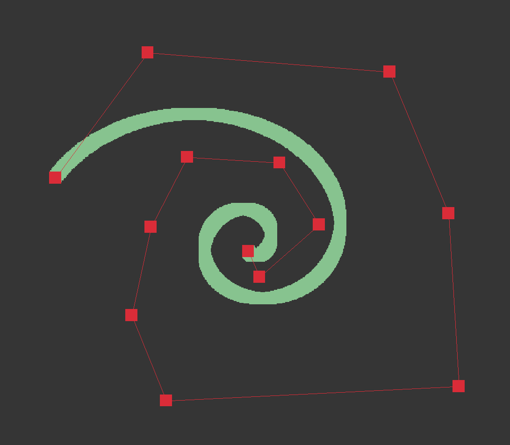

# Bézier Curve

Just a fun little project to learn how to render Bézier Curves.

## CPU implementation



## GPU implementation


## Screencasts

| Thumbnail | Title |
| --- | --- |
| [](https://www.youtube.com/watch?v=2oKzBq43ShE&list=PLpM-Dvs8t0VY5sYK_mm1k9dZw5tFWgg4L) | Coding Bézier Curves — Day 1 |
| [](https://www.youtube.com/watch?v=m4gVWZ_OkG4&list=PLpM-Dvs8t0VY5sYK_mm1k9dZw5tFWgg4L) | Bézier Curves using OpenGL Fragment Shader — Day 2 | 

## Quick Start

```console
$ make
$ ./cpu
$ ./gpu
```

## References

- https://www.geogebra.org/m/WPHQ9rUt
- https://gist.github.com/jordandee/94b187bcc51df9528a2f
